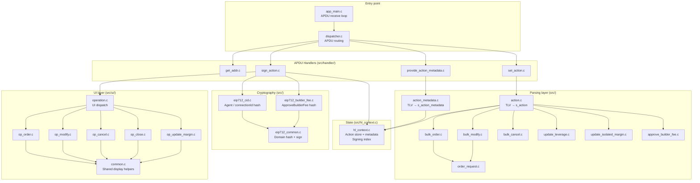

# Architecture

This document describes the internal source code structure of the Hyperliquid Ledger application.

## Module map

## Module responsibilities

### Entry point

| File | Responsibility |
|---|---|
| `src/app_main.c` | APDU receive/dispatch loop; NVM storage initialisation |
| `src/dispatcher.c` | Routes CLA/INS to the correct handler; validates P1/P2 |

### APDU handlers (`src/handler/`)

| File | APDU | Responsibility |
|---|---|---|
| `get_addr.c` | `GET_ADDRESS (0x01)` | Derives and returns the Ethereum address for a BIP-32 path |
| `provide_action_metadata.c` | `PROVIDE_ACTION_METADATA (0x02)` | Parses and PKI-verifies the action metadata; resets context |
| `set_action.c` | `SET_ACTION (0x03)` | Parses one action and stores it in the context |
| `sign_action.c` | `SIGN_ACTION (0x04)` | Shows UI (first call), then signs and returns the EIP-712 signature |

### Parsing layer (`src/`)

Each file implements a TLV parser for one action type using the SDK `lib_tlv` library. The parser produces a strongly-typed C struct which is validated before being stored in the context.

| File | Struct produced |
|---|---|
| `action_metadata.c` | `s_action_metadata` |
| `action.c` | `s_action` (dispatches to one of the below) |
| `bulk_order.c` | `s_bulk_order` (contains up to 5 `s_order_request`) |
| `bulk_modify.c` | `s_bulk_modify` (contains up to 5 `s_modify_request`) |
| `bulk_cancel.c` | `s_bulk_cancel` (contains up to 5 `s_cancel_request`) |
| `order_request.c` | `s_order_request` (limit or trigger sub-type) |
| `update_leverage.c` | `s_update_leverage` |
| `update_isolated_margin.c` | `s_update_isolated_margin` |
| `approve_builder_fee.c` | `s_approve_builder_fee` |

### Context (`src/hl_context.c`)

Global state machine holding:
- The verified `s_action_metadata` for the current signing session.
- Up to `MAX_ACTION_COUNT` parsed `s_action` values.
- A signing index tracking which action is next to be signed.

Zeroed with `explicit_bzero` at the end of a successful flow and on error recovery.

### Cryptography (`src/eip712_*.c`)

See [cryptography.md](cryptography.md) for a detailed description.

### UI layer (`src/ui/`)

| File | Operation type(s) handled |
|---|---|
| `operation.c` | Dispatch + shared review/sign screen setup |
| `op_order.c` | `ORDER` (limit and market, with optional TP/SL/leverage) |
| `op_modify.c` | `MODIFY` |
| `op_cancel.c` | `CANCEL` |
| `op_cancel.c` (`ui_cancel_tp_sl`) | `CANCEL_TP`, `CANCEL_SL`, `CANCEL_TP_SL` |
| `op_close.c` | `CLOSE` |
| `op_update_margin.c` | `UPDATE_MARGIN` |
| `common.c` | Shared helpers: margin/leverage display, Long/Short string computation |
