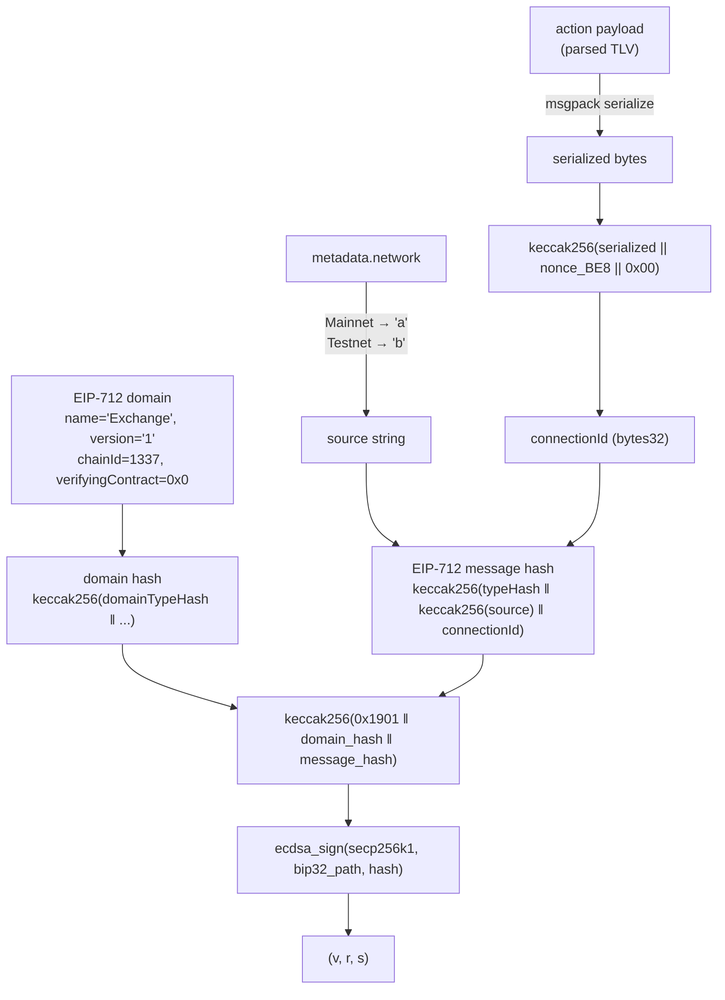
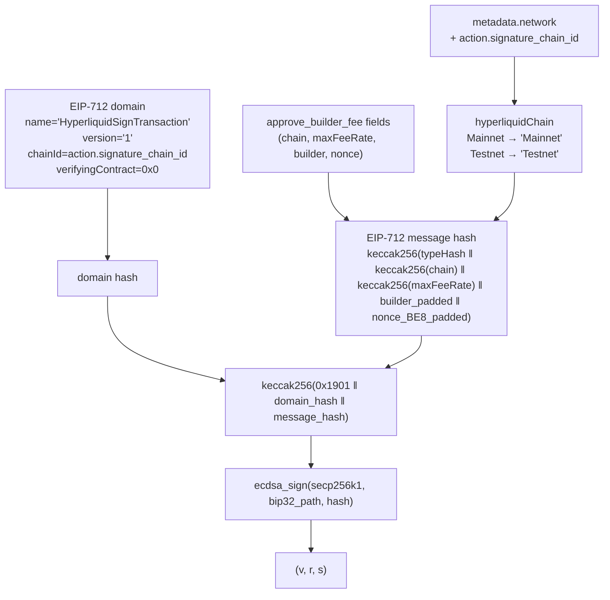

# Cryptography

This document describes how the Hyperliquid Ledger application constructs and signs EIP-712 messages.

## Overview

All signing uses **EIP-712 typed structured data signing** over the **secp256k1** curve (Ethereum-compatible). The final signature is `(v, r, s)` where `v ∈ {27, 28, 29, 30}`.

Two distinct EIP-712 schemas are used depending on the action type:

| Action type | Schema |
|---|---|
| All except `APPROVE_BUILDER_FEE` | `Agent(string source, bytes32 connectionId)` |
| `APPROVE_BUILDER_FEE` | `HyperliquidTransaction:ApproveBuilderFee(string hyperliquidChain, string maxFeeRate, address builder, uint64 nonce)` |

## Standard action signing (`Agent` schema)



### Connection ID computation

The `connectionId` is a 32-byte value that commits to the full action payload and a replay-prevention nonce:

```
connectionId = keccak256(
    msgpack(action)   // serialized action struct
    || nonce_BE8      // 8-byte big-endian nonce from the action TLV
    || 0x00           // end byte
)
```

The msgpack serialization is performed into a static 1024-byte scratch buffer (`g_raw_buf`).

### Network separation

The `source` string in the `Agent` struct differentiates Mainnet from Testnet:

| Network | `source` value |
|---|---|
| Mainnet | `"a"` |
| Testnet | `"b"` |

### EIP-712 domain (standard actions)

| Field | Value |
|---|---|
| `name` | `"Exchange"` |
| `version` | `"1"` |
| `chainId` | `1337` |
| `verifyingContract` | `0x0000...0000` |

## `APPROVE_BUILDER_FEE` signing



The domain for `APPROVE_BUILDER_FEE` uses a different `name` and a dynamic `chainId` taken from the action's `SIGNATURE_CHAIN_ID` field (rather than the fixed `1337` used for standard actions).

## EIP-712 encoding primitives

All EIP-712 hashing is implemented in `src/eip712_common.c`:

| Function | Purpose |
|---|---|
| `eip712_encode_dyn_val` | Encodes a dynamic type (string/bytes): `keccak256(data)`, fed into running hash |
| `eip712_encode_val` | Encodes a static type: right-aligned in 32 bytes, fed into running hash |
| `eip712_compute_domain_hash` | Computes the EIP-712 domain separator hash |
| `eip712_sign` | Finalises `keccak256(0x1901 ‖ domainHash ‖ messageHash)` and calls `bip32_derive_ecdsa_sign_rs_hash_256` |

## Metadata PKI verification

Before any action is accepted, `PROVIDE_ACTION_METADATA` must be called. The metadata TLV includes a `SIGNATURE` field which is verified against a Ledger PKI key. This prevents a malicious host from supplying forged metadata (e.g. a wrong asset ticker that misrepresents what the user is signing).

The PKI verification is performed by the SDK's `lib_pki` layer; only metadata signed by a trusted Ledger key is accepted.
