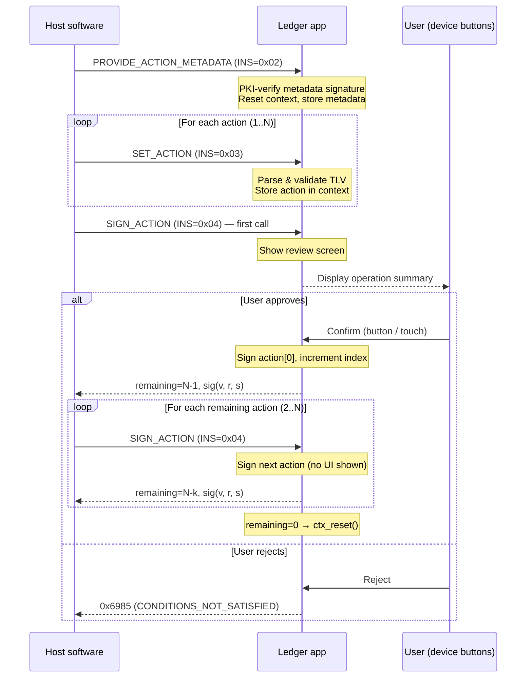
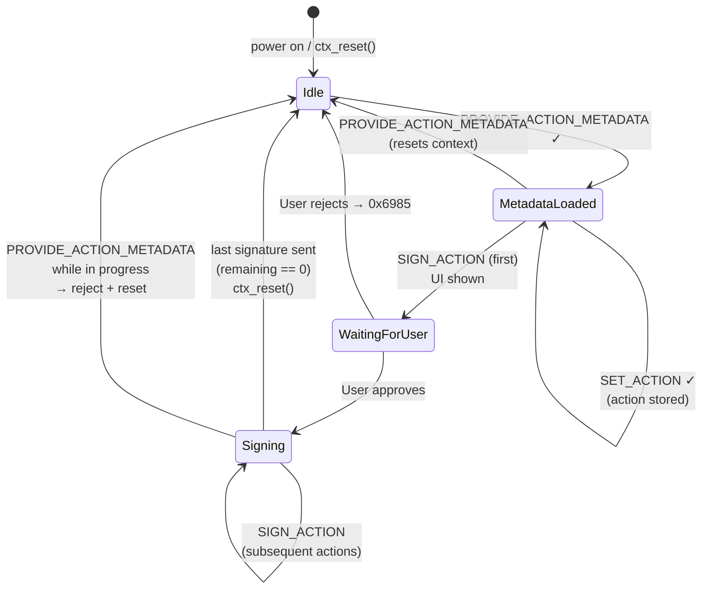

# Signing Flow

This document describes the end-to-end flow for signing a Hyperliquid action, from the host software perspective and from the application's internal perspective.

For the APDU wire format, see [APP_SPECIFICATION.md](../APP_SPECIFICATION.md).

## Host-side sequence

A signing session for a batch of N actions follows this sequence:

**Key design points:**
- The UI is shown **once** for the entire batch, on the first `SIGN_ACTION` call. All actions in the batch are covered by a single user approval.
- The metadata (asset ticker, margin, leverage, network) is PKI-verified by the app before use. It cannot be forged by the host.
- If `PROVIDE_ACTION_METADATA` is called again while a signing session is in progress (`action_index > 0`), the app rejects it and resets, preventing substitution attacks.

## Internal state machine

## What is shown on screen

The UI is composed of a list of tag/value pairs built from the metadata and the stored actions. The content varies by operation type:

| Operation | Fields displayed |
|---|---|
| `ORDER` (market) | Operation (Market Long/Short), Margin, Leverage, TP price, SL price, Size |
| `ORDER` (limit) | Operation (Limit Long/Short), Limit price, Margin, Leverage, TP price, SL price, Size |
| `MODIFY` | Active Position, Margin, Leverage, Size, New Take Profit, New Stop Loss |
| `CANCEL` | Operation (Cancel order), Margin, Leverage |
| `CANCEL_TP/SL/TP_SL` | Operation (Cancel order - target), Margin, Leverage |
| `CLOSE` | Position to close (Long/Short), Margin, Leverage, Size |
| `UPDATE_MARGIN` | Active Position, New Margin, Leverage |

The **intent string** shown in the confirmation banner (e.g. *"Open BTC long"*, *"Cancel order"*) is built from the same fields and is capped at `INTENT_STRING_LENGTH` characters.

> **Long/Short detection:** For reduce-only orders (closing a position), the Long/Short label is correctly inverted relative to `is_buy`. A reduce-only buy closes a short position (the position was Short); a reduce-only sell closes a long position (the position was Long).
